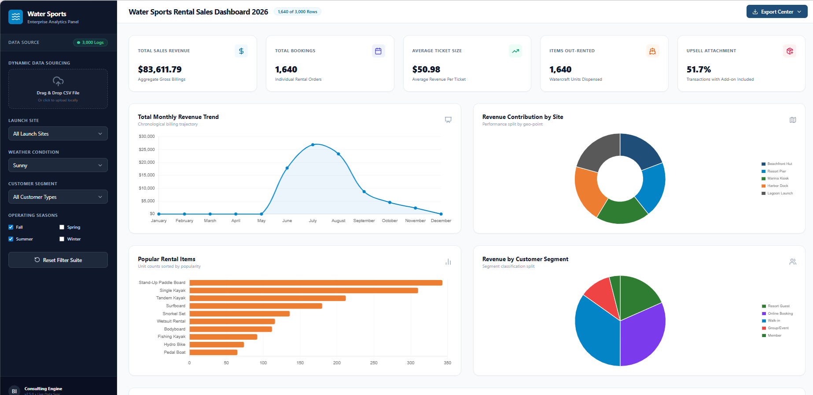
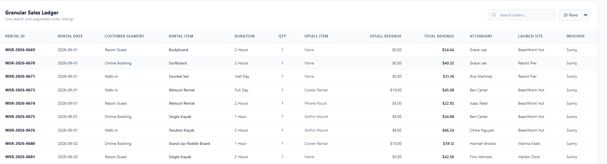
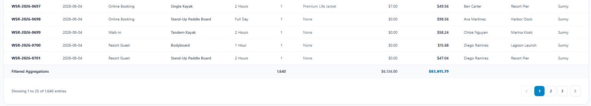

# AI-Powered Water Sports Rental Sales Analytics Dashboard

An interactive Business Intelligence dashboard built using a synthetic sales dataset, Google Gemini, HTML, JavaScript, Chart.js, and Excel dashboard design concepts.

---

## Project Overview

This project demonstrates an end-to-end analytics workflow, from synthetic dataset generation to interactive dashboard development and business insight visualization.

The objective was to simulate a real-world water sports rental business and create a dashboard that helps analyze:

* Revenue performance
* Customer behavior
* Product popularity
* Seasonal trends
* Launch site performance
* Operational metrics

The dashboard was developed using Google Gemini as an AI-assisted development tool and refined through multiple iterations.

---

## Project Workflow

### Step 1: Synthetic Dataset Generation

A realistic synthetic dataset containing approximately 3,000 rental transactions was created to simulate a water sports rental business.

The dataset includes:

* Rental transactions
* Revenue information
* Customer segments
* Rental products
* Employee performance
* Weather conditions
* Launch sites
* Payment methods
* Seasonal demand patterns

The data was designed to reflect realistic business behavior, including higher rental demand during summer months and lower activity during winter.

---

### Step 2: Dashboard Design & Development

After generating the dataset, Google Gemini was used to create and iteratively improve an interactive analytics dashboard.

The dashboard was designed for business users who need quick access to performance metrics and operational insights.

Features include:

* KPI cards
* Revenue trend analysis
* Product popularity analysis
* Customer segmentation
* Launch site performance
* Interactive filtering
* Search functionality
* Data exports
* Transaction-level sales ledger

---

## AI-Assisted Development Workflow

This project followed a prompt-driven dashboard development workflow using Google Gemini.

### Dataset Generation Prompt

```text
I'd like to get your help creating a fake data set that contains [sales information for a water sports rental shop that rents kayaks, paddle boards, etc.]

[The data set should contain 3,000 rows of data for the entire year, with seasonality trends and more sales in the summer months. There should also be a column for the employee's name responsible for the sale, with a total of 10 different employees. Each row should be for one rental item.]

Do you have any questions on this task?
```

### Dashboard Design Prompt

```text
I'd like to get your help designing a dashboard for the attached data set.

The dashboard should contain [simple charts that are easy for my coworkers (audience) to understand.]

[Audience is business professionals across several departments, and not all are well versed in data analytics and data visualization. So keep it simple.]

[Make sure the dashboard includes the following:

- Line chart for sales over time
- Bar chart for sales by team member]

Provide additional charts or metrics that are interesting.

[Keep the dashboard simple with 4 to 6 charts max and some cards]

[Use my brand color palette or default Office theme]

Consider data visualization best practices when designing the charts.

The dashboard will eventually be built into Excel, so take that into consideration when designing. But I would first like you to code an interactive web page so we can quickly iterate on the design.

The output should be a web page.

What questions do you have about this project/task before you get started?
```

---

## My Contributions

Although Google Gemini was used as a development assistant, I was responsible for:

* Defining the business scenario
* Designing the dataset requirements
* Customizing AI prompts
* Generating and validating synthetic data
* Reviewing dashboard outputs
* Refining KPI selection
* Testing dashboard functionality
* Improving dashboard usability
* Preparing the project for deployment
* Publishing the project on GitHub

---

## Dashboard Features

### KPI Metrics

* Total Sales Revenue
* Total Bookings
* Average Ticket Size
* Items Out-Rented
* Upsell Attachment Rate

### Interactive Analytics

* Monthly Revenue Trends
* Revenue by Launch Site
* Revenue by Customer Segment
* Product Popularity Analysis
* Dynamic Filtering
* Search Functionality

### Data Exploration

* Detailed Sales Ledger
* Pagination
* Transaction-Level Analysis
* Export Capabilities

---

## Screenshots

### Dashboard Overview



### Sales Ledger



### Sales Ledger Continuation



---

## Technologies Used

* Microsoft Excel
* CSV Data Processing
* HTML5
* CSS3
* JavaScript
* Chart.js
* Google Gemini
* GitHub
* GitHub Pages

---

## Skills Demonstrated

* Data Analytics
* Business Intelligence
* Dashboard Design
* Data Visualization
* KPI Development
* Excel Reporting Concepts
* Synthetic Data Generation
* AI-Assisted Development
* Front-End Development
* GitHub Deployment

---

## Future Enhancements

* AI Insights Panel
* Revenue Forecasting
* Excel Dashboard Version
* Power BI Dashboard Version
* Automated Business Recommendations

---

## Disclaimer

This project uses a synthetic dataset created for educational and portfolio purposes. No real customer or business data was used.

Google Gemini was used as an AI-assisted development tool for dashboard generation and refinement. All requirements, validation, testing, customization, and final implementation decisions were performed by the project author.
